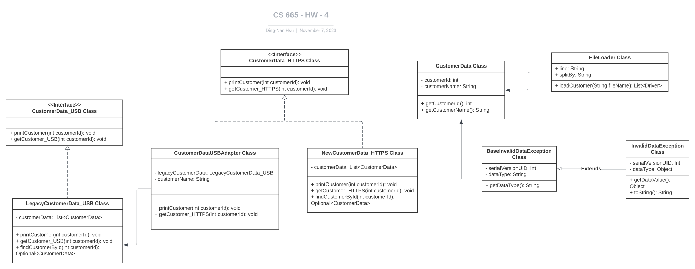

| CS-665       | Software Design & Patterns |
| ------------ | -------------------------- |
| Name         | Dingnan Hsu                |
| Date         | 11/05/2023                 |
| Course       | 2023 Fall                  |
| Assignment # | 4                          |

# Assignment Overview

Create a software solution that allows the old system, which accesses customer data via USB and binary files, to work seamlessly with the new system, which uses HTTPS and a REST API. The goal is to ensure the legacy system's interface can function with the new system's API, integrating the two for unified data access.

# GitHub Repository Link:

https://github.com/dddingnan/cs-665-assignment-4

# Implementation Description

For each assignment, please answer the following:

- Explain the level of flexibility in your implementation, including how new object types can
  be easily added or removed in the future.
- Discuss the simplicity and understandability of your implementation, ensuring that it is
  easy for others to read and maintain.
- Describe how you have avoided duplicated code and why it is important.
- If applicable, mention any design patterns you have used and explain why they were
  chosen.

---

### `Answer`

1. `Flexibility`
   - `CSV Data Storage`: Using CSV files for data storage makes it simple to add, modify, or remove customer without changing the core code. For instance, if we wish to incorporate new customer, we simply need to ensure that the new customer class implements the Customer data interface by adding into the CSV files.
2. `Simplicity & Understandability`
   - By using interfaces and classes to specific functionality (like CustomerData_HTTPS). This division can make the system more understandable for new developers or when maintaining the code.
3. `Avoidance of Duplicated Code`
   - The use of an adapter pattern with `CustomerDataUSBAdapter` helps avoid duplicated code by allowing the new system to use the legacy `CustomerData_USB` interface without having to reimplement its functionality. Ensuring that all customer data operations are handled through well-defined interfaces can prevent code duplication, as any changes to the data handling would be localized to the specific implementations of these interfaces.
4. `Design patterns`
   - `Adapter pattern`: This choice was made to ensure to reconcile the differences between the legacy `CustomerData_USB` and the new `CustomerData_HTTPS` interface. [The main purpose is to create a bridge between two incompatible interfaces. This is achieved by creating an adapter class that joins the functionalities of independent or incompatible interfaces.](https://en.wikipedia.org/wiki/Adapter_pattern)

## UML Diagram



# Maven Commands

We'll use Apache Maven to compile and run this project. You'll need to install Apache Maven (https://maven.apache.org/) on your system.

Apache Maven is a build automation tool and a project management tool for Java-based projects. Maven provides a standardized way to build, package, and deploy Java applications.

## Compile

Type on the command line:

```bash
mvn clean compile
```

## Run

Type on the command line:

```bash
mvn exec:java
```

## JUnit Tests

JUnit is a popular testing framework for Java. JUnit tests are automated tests that are written to verify that the behavior of a piece of code is as expected.

In JUnit, tests are written as methods within a test class. Each test method tests a specific aspect of the code and is annotated with the @Test annotation. JUnit provides a range of assertions that can be used to verify the behavior of the code being tested.

To run, use the following command:

```bash
mvn clean test
```

## Spotbugs

SpotBugs is a static code analysis tool for Java that detects potential bugs in your code. It is an open-source tool that can be used as a standalone application or integrated into development tools such as Eclipse, IntelliJ, and Gradle.

SpotBugs performs an analysis of the bytecode generated from your Java source code and reports on any potential problems or issues that it finds. This includes things like null pointer exceptions, resource leaks, misused collections, and other common bugs.

Use the following command:

```bash
mvn spotbugs:gui
```

For more info see
https://spotbugs.readthedocs.io/en/latest/maven.html

SpotBugs https://spotbugs.github.io/ is the spiritual successor of FindBugs.

## Checkstyle

Checkstyle is a development tool for checking Java source code against a set of coding standards. It is an open-source tool that can be integrated into various integrated development environments (IDEs), such as Eclipse and IntelliJ, as well as build tools like Maven and Gradle.

Checkstyle performs static code analysis, which means it examines the source code without executing it, and reports on any issues or violations of the coding standards defined in its configuration. This includes issues like code style, code indentation, naming conventions, code structure, and many others.

The following command will generate a report in HTML format that you can open in a web browser.

```bash
mvn checkstyle:checkstyle
```

The HTML page will be found at the following location:
`target/site/checkstyle.html`
